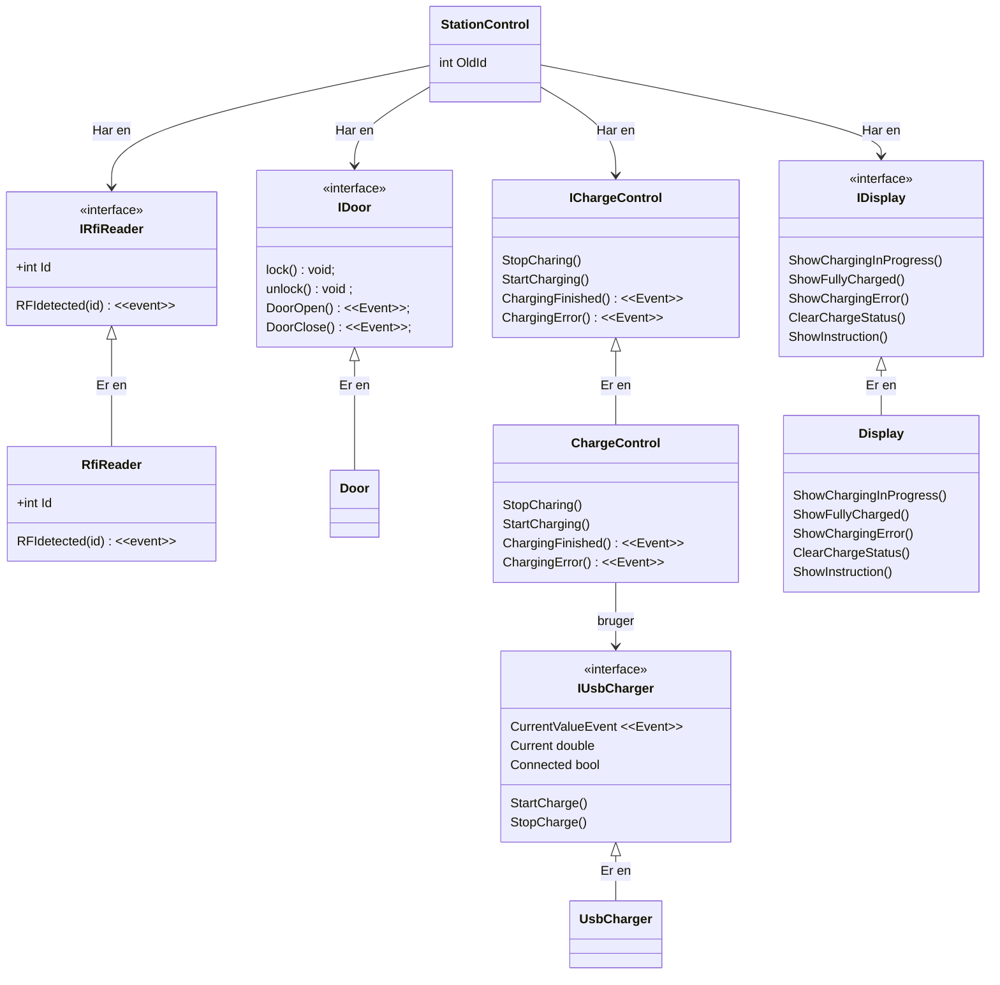

```mermaid
classDiagram


    class StationControl{
        int OldId

    }

    class IDoor {
        <<interface>>
        lock() void;
        unlock()void ;
        DoorOpen() ~~Event~~;
        DoorClose()~~Event~~;
    }
   class IRfiReader{
        <<interface>>
        RFIdetected(id)~~event~~
        +int Id

        
    }
    class RfiReader{
         RFIdetected(id)~~event~~
         +int Id
        
    }
    class Door { 
        
    }
    class IUsbCharger {
        <<interface>>
        CurrentValueEvent ~~Event~~
        Current double
        Connected bool
        StartCharge()
        StopCharge()

        
    }
    class UsbCharger{
        
    }
    class ChargeControl{
        
    }
    class IChargeControl{
        StopCharing()
        StartCharging()

        ChargingFinished() ~~Event~~
        ChargingError() ~~Event~~
    }
    class ChargeControl{
        StopCharing()
        StartCharging()

        ChargingFinished() ~~Event~~
        ChargingError() ~~Event~~
    }
 
    class IDisplay{
        <<interface>>
        ShowChargingInProgress()
        ShowFullyCharged()
        ShowChargingError()
        ClearChargeStatus()   
        ShowInstruction() 

    }

    class Display{
        ShowChargingInProgress()
        ShowFullyCharged()
        ShowChargingError()
        ClearChargeStatus()   
        ShowInstruction()

    }

    %% Relationer
    StationControl --> IDoor: Har en
    IDoor <|-- Door: Er en

    StationControl--> IRfiReader: Har en
    IRfiReader <|-- RfiReader: Er en

    StationControl--> IDisplay: Har en
    IDisplay <|-- Display: Er en

    StationControl --> IChargeControl: Har en
    IChargeControl <|-- ChargeControl: Er en

    ChargeControl --> IUsbCharger: bruger
    IUsbCharger <|-- UsbCharger: Er en
```