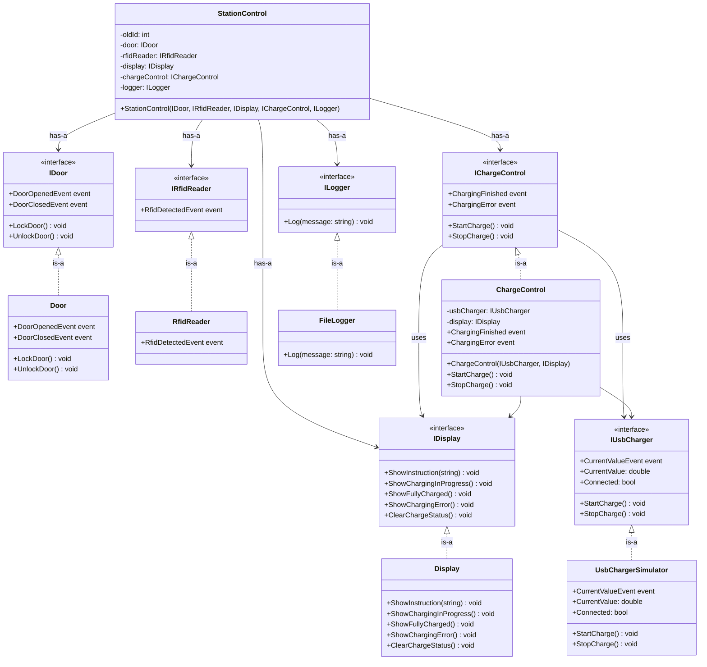

```mermaid
classDiagram
    direction TB
    
    %% ========== LAG 1: PRÆSENTATIONSLAG (ØVERST) ==========
    class StationControl {
        -oldId: int
        -door: IDoor
        -rfidReader: IRfidReader
        -display: IDisplay
        -chargeControl: IChargeControl
        -logger: ILogger
        +StationControl(IDoor, IRfidReader, IDisplay, IChargeControl, ILogger)
    }
    
    %% ========== LAG 2: FORRETNINGSLOGIK - INTERFACES  ==========
    class IDoor {
        <<interface>>
        +DoorOpenedEvent event
        +DoorClosedEvent event
        +LockDoor() void
        +UnlockDoor() void
    }
    
    class IRfidReader {
        <<interface>>
        +RfidDetectedEvent event
    }
    
    class IDisplay {
        <<interface>>
        +ShowInstruction(string) void
        +ShowChargingInProgress() void
        +ShowFullyCharged() void
        +ShowChargingError() void
        +ClearChargeStatus() void
    }
    
    class IChargeControl {
        <<interface>>
        +ChargingFinished event
        +ChargingError event
        +StartCharge() void
        +StopCharge() void
    }
    
    class IUsbCharger {
        <<interface>>
        +CurrentValueEvent event
        +CurrentValue: double
        +Connected: bool
        +StartCharge() void
        +StopCharge() void
    }
    
    class ILogger {
        <<interface>>
        +Log(message: string) void
    }
    
    %% ========== LAG 3: DATA IMPLEMENTERINGER  ==========
    class Door {
        +DoorOpenedEvent event
        +DoorClosedEvent event
        +LockDoor() void
        +UnlockDoor() void
    }
    
    class RfidReader {
        +RfidDetectedEvent event
    }
    
    class Display {
        +ShowInstruction(string) void
        +ShowChargingInProgress() void
        +ShowFullyCharged() void
        +ShowChargingError() void
        +ClearChargeStatus() void
    }
    
    class ChargeControl {
        -usbCharger: IUsbCharger
        -display: IDisplay
        +ChargingFinished event
        +ChargingError event
        +ChargeControl(IUsbCharger, IDisplay)
        +StartCharge() void
        +StopCharge() void
    }
    
    class UsbChargerSimulator {
        +CurrentValueEvent event
        +CurrentValue: double
        +Connected: bool
        +StartCharge() void
        +StopCharge() void
    }
    
    class FileLogger {
        +Log(message: string) void
    }
    
    %% ========== RELATIONER ==========
    %% Lag 1 -> Lag 2
    StationControl --> IDoor : has-a
    StationControl --> IRfidReader: has-a
    StationControl --> IDisplay: has-a
    StationControl --> IChargeControl: has-a
    StationControl --> ILogger: has-a
    
    %% Lag 2 -> Lag 2
    IChargeControl --> IUsbCharger : uses
    IChargeControl --> IDisplay : uses
    
    %% Lag 2 <- Lag 3 (implementations)
    IDoor <|.. Door : is-a
    IRfidReader <|.. RfidReader : is-a
    IDisplay <|.. Display : is-a
    IChargeControl <|.. ChargeControl : is-a
    IUsbCharger <|.. UsbChargerSimulator : is-a
    ILogger <|.. FileLogger : is-a
    
    %% Lag 3 -> Lag 2
    ChargeControl --> IUsbCharger
    ChargeControl --> IDisplay
```