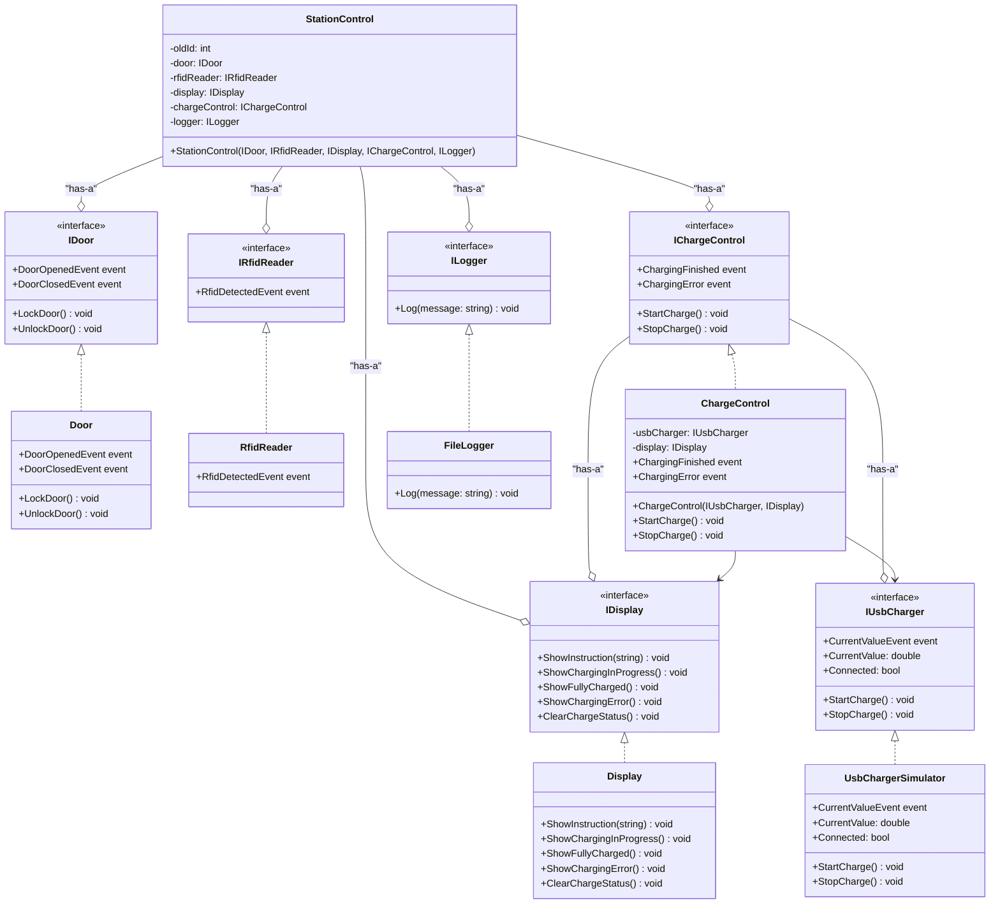

## Kommentarer
Systemet er designet efter en klassisk 3-lags arkitektur.
Øverste lag er Stationkontrol, som fungerer som højniveaumodellen og controlleren for hele systemet. Ved brug af Dependency Injection (DI) er denne klasse uafhængig af de konkrete lavniveau-moduler.
Det midterste lag udgøres af interfaces, som alle er rene. De definerer systemets kontrakter og skaber en klar adskillelse mellem lagene.
Nederste lag består af implementeringerne. Disse klasser opfylder de kontrakter, der er fastlagt af deres respektive interfaces.
Strukturen sikrer samlet set, at systemet er afkoblet, uafhængigt og let at teste.