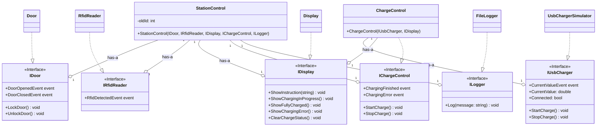

```mermaid
classDiagram
    %% ---------- Central Controller ----------
    class StationControl {
        -oldId: int
        +StationControl(IDoor, IRfidReader, IDisplay, IChargeControl, ILogger)
    }

    %% ---------- Interfaces (Abstractions) ----------
    class IDoor {
        <<Interface>>
        +LockDoor() void
        +UnlockDoor() void
        +DoorOpenedEvent event
        +DoorClosedEvent event
    }
    class IRfidReader {
        <<Interface>>
        +RfidDetectedEvent event
    }
    class IDisplay {
        <<Interface>>
        +ShowInstruction(string) void
        +ShowChargingInProgress() void
        +ShowFullyCharged() void
        +ShowChargingError() void
        +ClearChargeStatus() void
    }
    class IChargeControl {
        <<Interface>>
        +StartCharge() void
        +StopCharge() void
        +ChargingFinished event
        +ChargingError event
    }
    class IUsbCharger {
        <<Interface>>
        +CurrentValueEvent event
        +CurrentValue: double
        +Connected: bool
        +StartCharge() void
        +StopCharge() void
    }
    class ILogger {
        <<Interface>>
        +Log(message: string) void
    }

    %% ---------- Concrete Implementations ----------
    class Door
    class RfidReader
    class Display
    class ChargeControl {
        +ChargeControl(IUsbCharger, IDisplay)
    }
    class UsbChargerSimulator
    class FileLogger

    %% ---------- Relationships ----------
    
    %% StationControl depends on abstractions
    StationControl "1" --o "1" IDoor : has-a
    StationControl "1" --o "1" IRfidReader : has-a
    StationControl "1" --o "1" IDisplay : has-a
    StationControl "1" --o "1" IChargeControl : has-a
    StationControl "1" --o "1" ILogger : has-a

    %% ChargeControl depends on abstractions
    ChargeControl "1" --o "1" IUsbCharger : has-a
    ChargeControl "1" --o "1" IDisplay : has-a

    %% Concrete classes implement interfaces
    Door ..|> IDoor
    RfidReader ..|> IRfidReader
    Display ..|> IDisplay
    ChargeControl ..|> IChargeControl
    UsbChargerSimulator ..|> IUsbCharger
    FileLogger ..|> ILogger
```