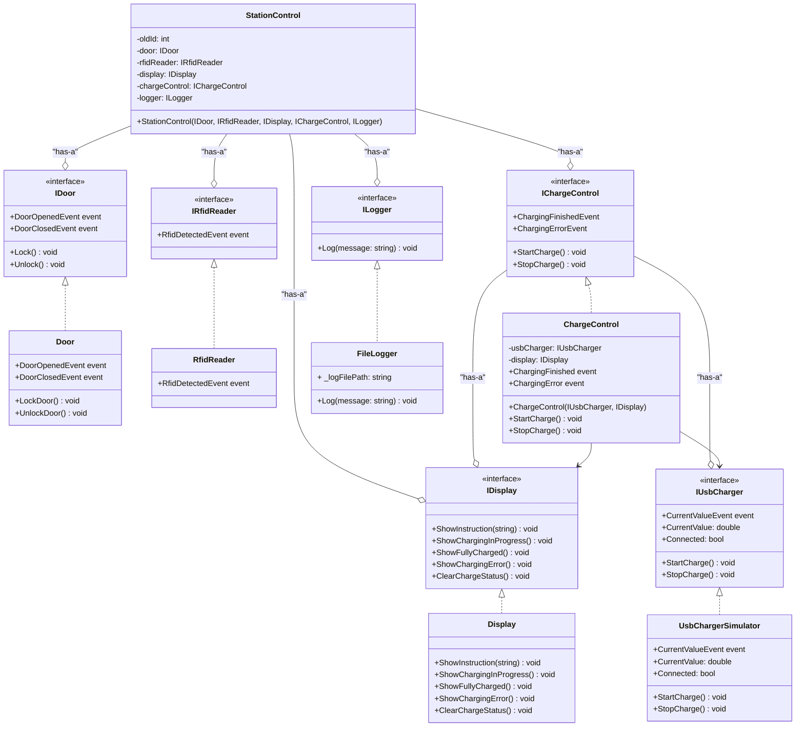
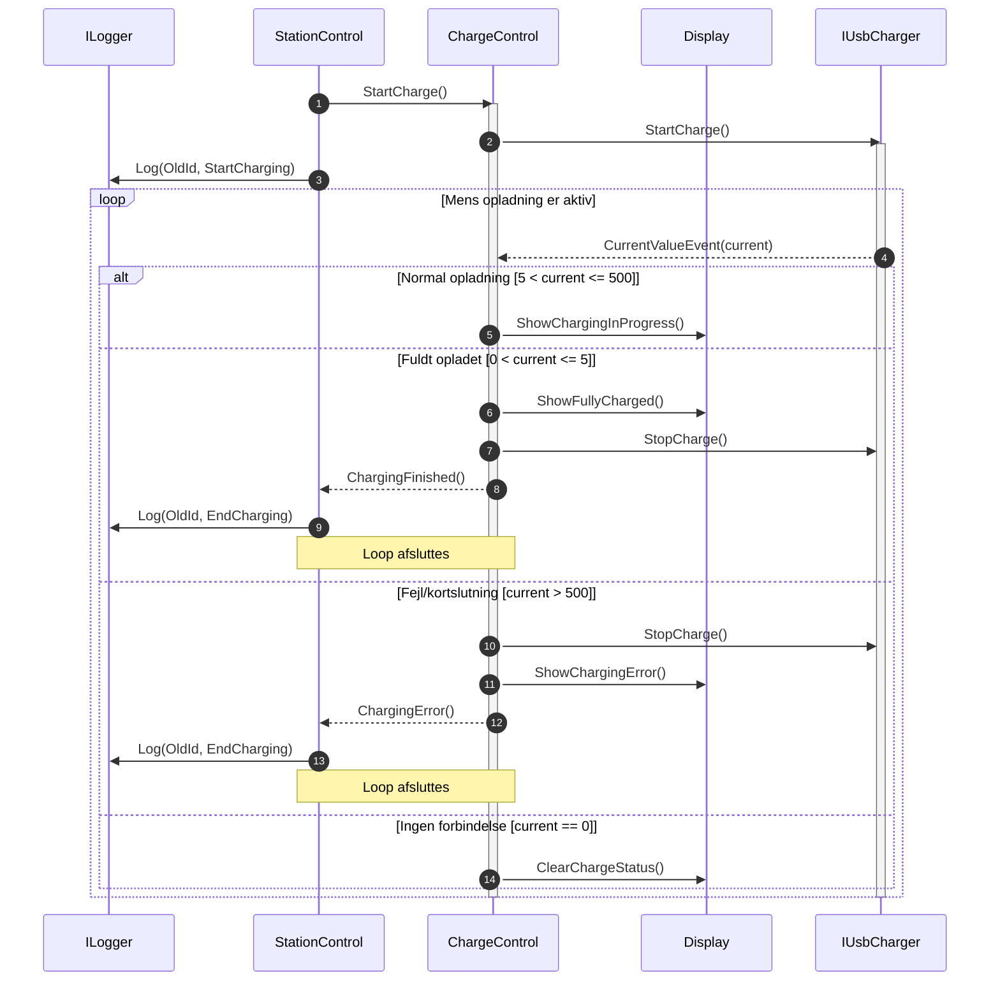

# Ladeskab til Mobiltelefon - Softwaredokumentation

## 1. Design og Arkitektur

### Klassediagram

Systemet er designet efter en klassisk 3-lags arkitektur.
Øverste lag er Stationkontrol, som fungerer som højniveaumodellen og controlleren for hele systemet. Ved brug af Dependency Injection (DI) er denne klasse uafhængig af de konkrete lavniveau-moduler. Dette sikre at det er muligt at udskifte komponenterne med mocks eller fakes under test. 
Det midterste lag udgøres af interfaces, som alle er rene. De definerer systemets kontrakter og skaber en klar adskillelse og afkobling mellem lagene. 
Nederste lag består af implementeringerne. Disse klasser opfylder de kontrakter, der er fastlagt af deres respektive interfaces.

Strukturen følger SOLID-principperne og sikrer samlet set, at systemet er afkoblet, uafhængigt og let at teste.

### Sekvensdiagram

Der er identificeret fem komponenter i sekvensdiagrammet. ChargeControl fungerer som controllerklassen i designet, jf. opgavebeskrivelsen. De øvrige komponenter er Display og StationControl samt de to interfaces IUsbCharger og ILogger.

Selve styringslogikken er pakket ind i et loop, som viser, at eventet CurrentValueEvent sendes løbende fra USBCharger til ChargeControl. ChargeControl lytter passivt efter ændringer i strømmen.

De forskellige betingelser er pakket ind i alternatives, og loopet breakes, når en betingelse er opfyldt. For at holde komponenterne afkoblet sender ChargeControl events op til StationControl om, at opladningen er afsluttet eller der er opstået fejl. StationControl reagrerer på event fra ChargeControl ved at kalde ILogger.

Designet følger SOLID-principperne, med fokus på afkobling, fleksibilitet og skalerbarhed. Single Repsponsibility Princeple understøttes lideledes da ChargeControl kun tager sig af opladning, og StationControl tager sig af den overordtnede systemtilstand. Dette gør systemet lettere at udvide og vedligeholde.

## 2. Design for Testbarhed

Systemet er designet med testbarhed som vores primære fokus. Der er lavet interfaces (IDoor, IDisplay, ILogger, osv), for at sikre lav kobling mellem klasserne. Dette gør det så muligt at teste hvert komponent isoleret via. Mock objekter, som eksempelvis NSubstitute i unit test. Alle afhængigheder bliver også injected via Constructor (Dependency Injection).

Eksempelvis testes Stationcontrol-klassen ved at erstatte de konkrete implementationer af IDisplay, IChargeControl, IDoor, Osv med mocks.
Dette gør det så muligt at lave præcise og kontrollerede testscenarier, hvor man kan simulere actions som eksempelvis dør-åbning og opladningsfejl uden fysisk hardware.

## 3. Refleksioner over Projektet

### Refleksion over Valgte Design

Det valgte design virkede for os meget intuitivt, da der først og fremmest var givet fem .cs-filer til at arbejde videre på. På den måde var fundamentet lavet, og der kunne så impleteres videre på systemet. I forhold til den resterende implementation, dragede vi inspiration fra kursets indhold, hvor der gerne skal være så løs kobling som muligt, så systemet bliver skalérbart.

#### Hvorfor blev dette design valgt?
Dette design blev valgt for at lave et afkoblet system, som nemt kan vedligeholdes, testes og udvides. Vi har i forlængelse af dette istedet for at lave en fake lavet UsbChargerSimulator, som agere som en fake, men stadig har en reel implementering, som simulere en usbcharger, da vi ikke har selve hardwaren tilgængelig.

#### Fordele
- Systemet er modulært og let at udvide, fordi alle afhængiheder håndteres gennem interfaces og events.
- Høj testbarhed, da komponenter kan testes isoleret via mocks.
- Koden er overskuelig og følger SOLID-principperne, især Single Responsibility.

#### Ulemper og Overvejelser
- Alle interfaces og events kan gør systemet mere komplekst at sætte sig ind i hvis ikke man har kigget på det før.

### Refleksion over Arbejdsproces og Fordeling

For os har det givet os nogle fordele, da vi hver især har forskellige styrker, som vi har implementeret bedst muligt i vores gruppearbejde. Et eksempel i dette tilfælde er at én har fokuseret på diagrammer, én har lavet unit test, én har implementeret systemet. Derudover har vi samtidig arbejdet indover hinandens arbejde, så man har haft en primær prioritet og hjulpet til, hvor det er nødvendigt.

En negativ ting til dette er at vi ikke har været fysisk til stede når vi har arbejdet på det, hvilket gør kommunikationen sværere.

### Refleksion over Fælles Repository og Continuous Integration (CI)

Det har været nyt at arbejde indenfor Continuous Integration, hvor vi har skulle arbejde hver for sig, commite og pushe vores ændringer, for efterfølgende at arbejde videre på en andens fremskridt. Dette har givet os en god forståelse for hvordan arbejdet vil fungere ude blandt virksomheder. 

#### Observationer
Under udviklingen har vi oplevet at brugen af GitLab CI gav et godt overblik over projektets stabilitet. Vi kunne hurtigt se hvis et commit brød buildet eller fik nogen tests til at fejle. På grund af det kunne vi rette fejlene tidligt i processen. Det blev på baggrund af det tydeligt hvor vigtigt det er med automatiserede tests og kontinuerlig integration

#### Fordele
- Det har givet os frihed til at arbejde med opgaven når vi selv har haft tid til det, og ikke været afhængig af at andre skal være til stede.
- Vi har lært en stor del omkring Git, og hvordan det fungerer når man arbejder med konceptet Continuous Integration.
- Fordelen ved at benytte sig af dette koncept er også at sikre sig at systemet virker, ved hvert push. På denne måde sikrer vi også at når et andet gruppemedlem har pushet, så virker systemet og der skal ikke bruges timer på at debugge hvad en anden har lavet.

#### Ulemper og Udfordringer
En af de støreste udfordringer ved brugen af CI var at sikre, at alle testprojekter og afhængigheder blev korrekt inkluderet i build-processen. Små fejl i projektfilen eller manglede references kunne gøre at pipelinen fejlede, selvom koden virkede lokalt.  
