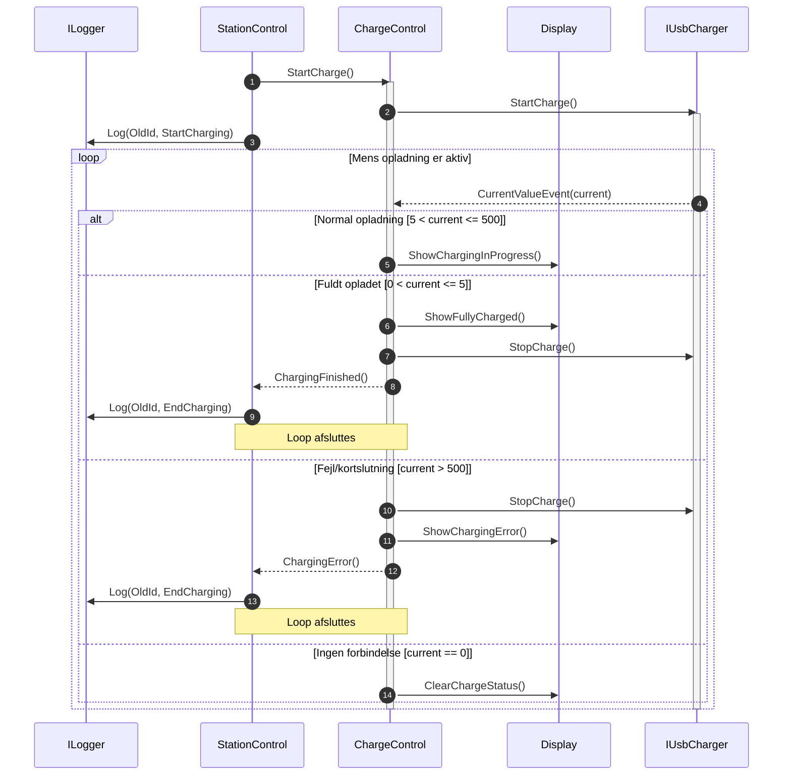

```mermaid
sequenceDiagram
    autonumber
    participant LOG as ILogger
    participant SC as StationControl
    participant CC as ChargeControl
    participant DP as Display
    participant USB as IUsbCharger

    SC->>CC: StartCharge()
    activate CC
    
    CC->>USB: StartCharge()
    activate USB
    
    SC->>LOG: Log(OldId, StartCharging)

    loop Mens opladning er aktiv
        %% USB sender løbende events med strømværdien
        USB-->>CC: CurrentValueEvent(current)

        alt Normal opladning [5 < current <= 500]
            CC->>DP: ShowChargingInProgress()

        else Fuldt opladet [0 < current <= 5]
            CC->>DP: ShowFullyCharged()
            CC->>USB: StopCharge()
            CC-->>SC: ChargingFinished()
            SC->>LOG: Log(OldId, EndCharging)
            Note over CC,SC: Loop afsluttes

        else Fejl/kortslutning [current > 500]
            CC->>USB: StopCharge()
            CC->>DP: ShowChargingError()
            CC-->>SC: ChargingError()
            SC->>LOG: Log(OldId, EndCharging)
            Note over CC,SC: Loop afsluttes

        else Ingen forbindelse [current == 0]
            CC->>DP: ClearChargeStatus()
        end
    end

    deactivate USB
    deactivate CC

```
