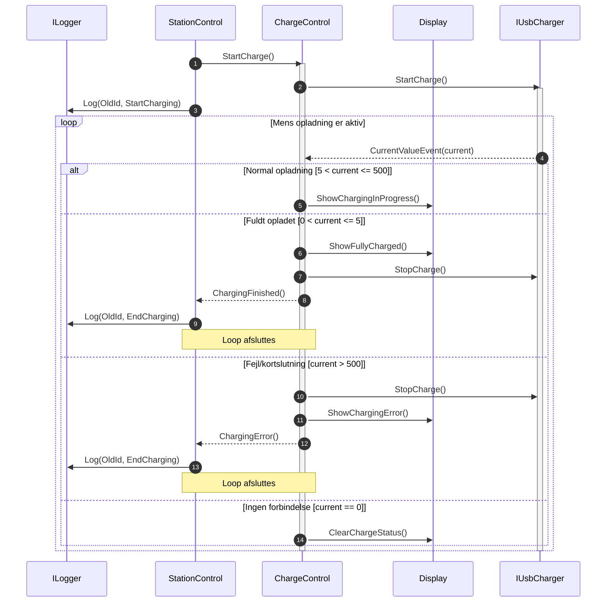

## Kommentarer: 
Der er identificeret fem komponenter i sekvensdiagrammet. ChargeControl fungerer som controllerklassen i designet, jf. opgavebeskrivelsen. De øvrige komponenter er Display og StationControl samt de to interfaces IUsbCharger og ILogger.

Selve styringslogikken er pakket ind i et loop, som viser, at eventet CurrentValueEvent sendes løbende fra USBCharger til ChargeControl. ChargeControl lytter passivt efter ændringer i strømmen.

De forskellige betingelser er pakket ind i alternatives, og loopet breakes, når en betingelse er opfyldt. For at holde komponenterne afkoblet sender ChargeControl events op til StationControl om, at opladningen er afsluttet eller der er opstået fejl. StationControl videresender disse events til ILogger.

Designet følger SOLID-principperne, med fokus på afkobling, fleksibilitet og skalerbarhed. Dette gør systemet lettere at udvide og vedligeholde.