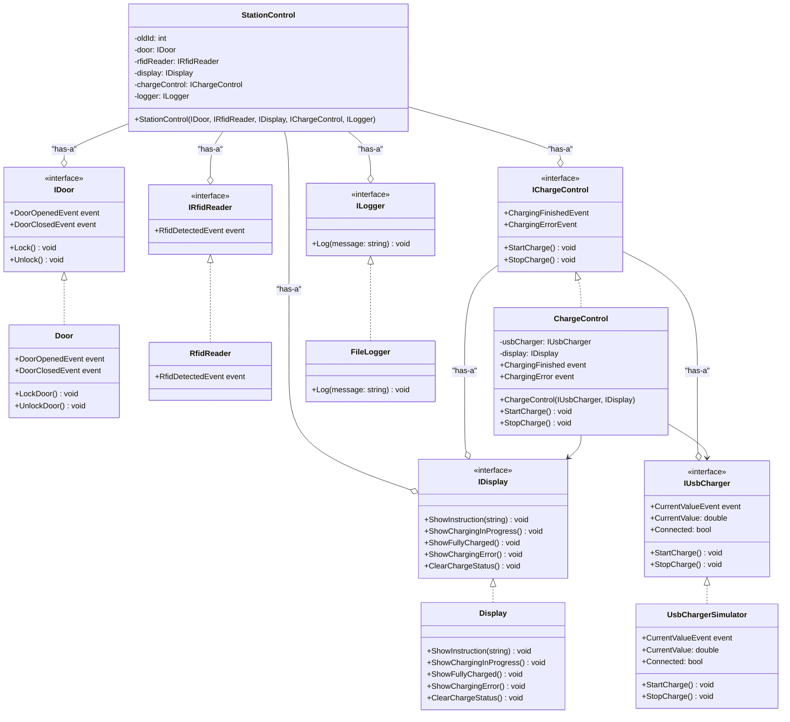
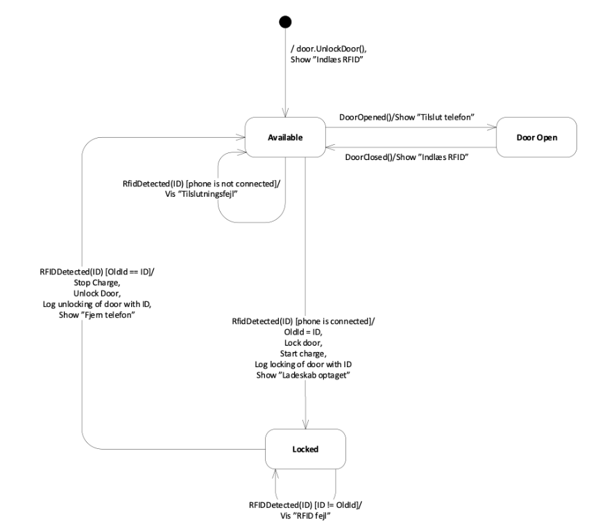
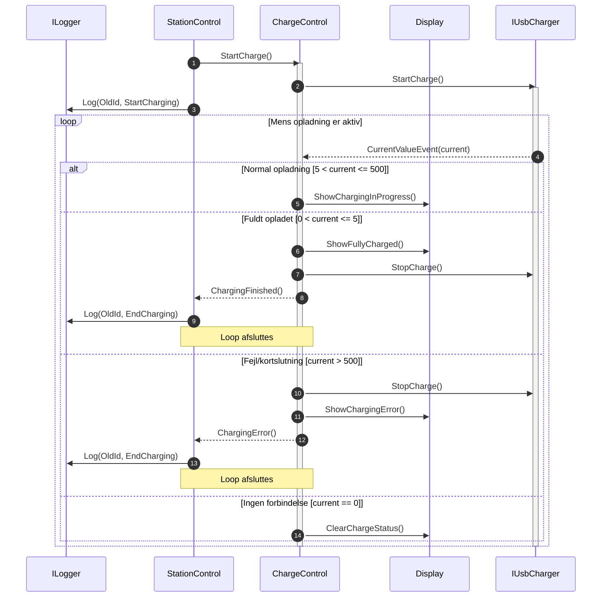

***

# Ladeskab til Mobiltelefon - Software Dokumentation

Dette repository indeholder softwaren til et ladeskabssystem til mobiltelefoner. Systemet er designet til at tilbyde sikker opbevaring og opladning af en mobiltelefon, autentificeret via en RFID-chip.

Softwaren er bygget op omkring principper for robust og testbar arkitektur, der sikrer en klar adskillelse af ansvar mellem systemets forskellige komponenter.

## Systemarkitektur og Design

Systemet er designet efter en 3-lagsarkitektur for at sikre lav kobling og høj kohæsion.

1.  **Præsentations-/Kontrollag:** `StationControl`-klassen fungerer som systemets centrale hjerne. Den orkestrerer interaktioner mellem de forskellige moduler og håndterer den overordnede tilstandslogik.
2.  **Forretningslogik (Interfaces):** Et lag af interfaces (`IDoor`, `IRfidReader`, `IChargeControl` etc.) definerer de kontrakter, som de forskellige dele af systemet skal overholde. Dette afkobler høj-niveau logik fra konkrete implementationer.
3.  **Implementeringslag:** Konkrete klasser (`Door`, `RfidReader`, `ChargeControl`, etc.) implementerer logikken defineret i interfaces.

Designet gør udstrakt brug af **Dependency Injection (DI)**, hvor afhængigheder gives til klasserne via deres constructor. Dette, kombineret med de interface-baserede kontrakter, gør systemet ekstremt testbart og fleksibelt.

### Klassediagram

Diagrammet nedenfor viser relationerne mellem de forskellige klasser og interfaces i systemet.

## Systemets Tilstandslogik (State Machine)

Kernen i systemets logik er en state machine, der styrer ladeskabets adfærd. `StationControl`-klassen implementerer denne logik og kan befinde sig i tre primære tilstande:

*   **Available**: Skabet er ledigt og ulåst. Brugeren kan åbne døren for at tilslutte en telefon.
*   **DoorOpen**: Døren er åben. Systemet venter på, at døren lukkes.
*   **Locked**: En telefon er tilsluttet, og døren er låst med en RFID-chip. Opladning er i gang.

Overgange mellem disse tilstande udløses af hændelser som RFID-scanning, og at døren åbnes eller lukkes.

## Opladningslogik

Ansvaret for selve opladningsprocessen er håndteret af `ChargeControl`, som overvåger ladestrømmen fra en `IUsbCharger`. Den reagerer på ændringer i strømstyrken for at informere brugeren om opladningens status.

*   **Normal opladning (5 < current ≤ 500 mA):** Displayet viser, at opladning er i gang.
*   **Fuldt opladet (0 < current ≤ 5 mA):** Opladningen stoppes, og displayet viser, at telefonen er fuldt opladet.
*   **Fejl/Kortslutning (current > 500 mA):** Opladningen afbrydes øjeblikkeligt for at beskytte udstyret, og en fejlmeddelelse vises.

### Sekvensdiagram for Opladning

Dette diagram illustrerer interaktionen mellem komponenterne, når en opladning starter og overvåges.

## Design for Testbarhed

Testbarhed har været et centralt fokus i designprocessen.

*   **Interfaces og DI:** Ved konsekvent brug af interfaces og Dependency Injection kan hver komponent testes i isolation. I unit tests erstattes de virkelige afhængigheder med mock-objekter (via NSubstitute), hvilket giver fuld kontrol over testscenarierne.
*   **Hardware Simulering:** Klassen `UsbChargerSimulator` fungerer som en "fake" for den fysiske USB-oplader. Den simulerer en realistisk opladningscyklus, inklusiv faldende strømstyrke over tid, samt fejlscenarier som overbelastning. Dette gør det muligt at udvikle og teste hele opladningslogikken uden adgang til den endelige hardware.
*   **Event-drevet Kommunikation:** Kommunikation mellem moduler sker via events. Dette afkobler komponenterne og gør det let at teste, om de reagerer korrekt på hændelser.

## Simulering og Kørsel

Projektet indeholder en konsolapplikation (`Program.cs`), der fungerer som en simpel simulator for at interagere med ladeskabet.

Start applikationen og brug følgende taster til at simulere handlinger:

*   **`O`**: Åbner døren (Open).
*   **`C`**: Lukker døren (Close).
*   **`R`**: Scanner en RFID-chip (Read). Du vil blive bedt om at indtaste et numerisk ID.
*   **`E`**: Afslutter simulationen (Exit).
